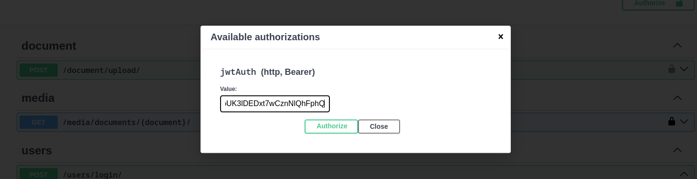
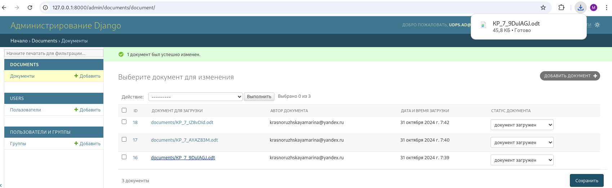
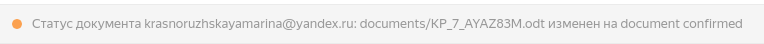

# API для загрузки документов зарегистрированными пользователями

Сервис для обработки загружаемых документов позволяет зарегистрированным пользователям загружать документы через API.
При загрузке документа администратор платформы получает уведомление по электронной почте. Администратор просматривает,
подтверждает или отклоняет загруженные документы через Django admin. После подтверждения или отклонения документа
пользователю, загрузившему документ, приходит уведомление по электронной почте.

## Инструкции по развертыванию проекта с Docker

1. Убедиться, что установлен Docker, Docker-compose
2. Клонировать репозиторий
   ```sh
   git clone git@github.com:MarinaKrasnoruzhskaya/uploaded_document_service.git
   ```
3. Заполнить файл ```.env.sample``` и переименовать его в файл с именем ```.env```
4. Собрать образ
   ```sh
   docker-compose build
   ```
5. Запустить контейнеры
   ```sh
   docker-compose up
   ```

## Инструкции по развертыванию проекта без Docker

1. Клонировать репозиторий
   ```sh
   git clone git@github.com:MarinaKrasnoruzhskaya/uploaded_document_service.git
   ```
2. Перейти в директорию
   ```sh
   cd uploaded_document_service
   ```
3. Установить виртуальное окружение
   ```sh
   python -m venv env
   ```
4. Активировать виртуальное окружение
   ```sh
   source env/bin/activate
   ```
5. Установить зависимости
   ```sh
   pip install -r requirements.txt
   ```
6. Заполнить файл ```.env.sample``` и переименовать его в файл с именем ```.env```
7. Создать БД ```uds```
   ```
   psql -U postgres
   create database udps;  
   \q
   ```
8. Применить миграции
    ```sh
   python manage.py migrate
    ```
9. Создать суперпользователя
    ```sh
   python manage.py csu
   ```
10. Запустить Celery worker
   ```sh
   celery -A config worker -l INFO
   ``` 
11. Запустить проект
   ```sh
   python manage.py runserver
   ```   

## Пользователь проекта:

1. Superuser: "email": "udps.ad@yandex.ru", "password": "Admin123Admin"

## Документация проекта:

1. http://127.0.0.1:8000/swagger-ui/
2. http://127.0.0.1:8000/redoc/

## Пример тестирования проекта с помощью swagger-ui:

1. /users/register/ - регистрация пользователя:

   Не забудьте нажать "Try in out"!
   
   

2. /users/login/ - получение веб-токенов для доступа и обновления, для подтверждения подлинности учетных данных

   
   

3. /users/token/refresh/ - получение веб-токен доступа

   
   

4. /document/upload/ - загрузка документа

   Не забудьте авторизоваться по token или refresh
   
   

   Теперь можно выполнить загрузку документа
   
   
   

   На электронную почту администратора приходит сообщение
   
   

5. /admin/ - Django admin

   Нажатие на имя документа в столбце Загруженный документ приводит к открытию или скачиванию документа для дальнейшего его
   просмотра
   
   
   
   Добавлены быстрые действия для подтверждения или отклонения загруженных документов
   
   * через групповые операции и подтверждение с помощью кнопки Выполнить
   
   
   
   * через раскрывающийся список в поле Статус документа и подтверждение с помощью кнопки Сохранить
   
   
   
   После подтверждения или отклонения документа администратором на почту пользователя, загрузившего документ, приходит
   сообщение:
   
   

## Лицензия:

Этот проект лицензирован по [лицензии MIT](LICENSE)
